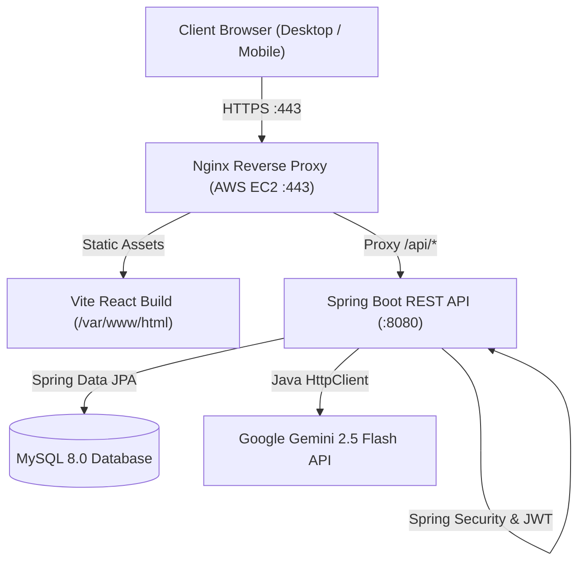
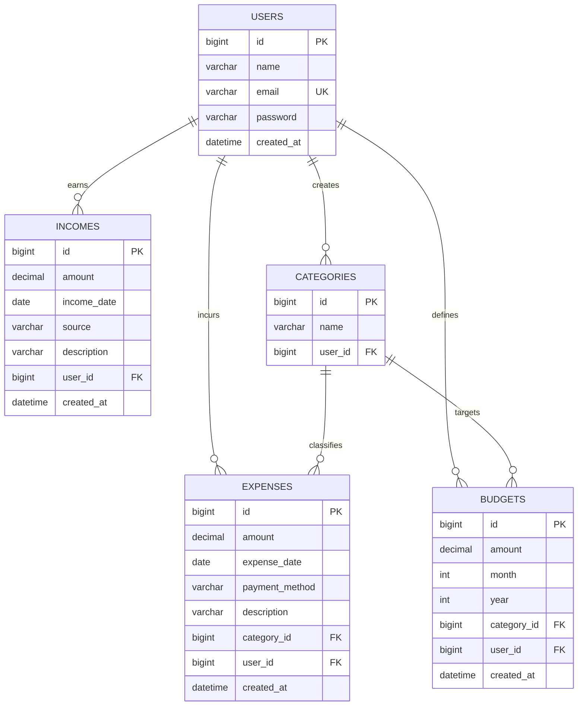

# 💸 ExpenseFlow — Personal Finance Management Platform

<div align="center">

[](https://www.expenseflow.dev/)
[](https://react.dev/)
[](https://spring.io/projects/spring-boot)
[](https://www.mysql.com/)
[](https://aws.amazon.com/)
[](https://ai.google.dev/)

**A full-stack personal finance platform built with React and Spring Boot to track expenses, manage income, enforce category budgets, and generate AI-driven spending insights.**

> 🚀 **Live Production Deployment:** [https://www.expenseflow.dev/](https://www.expenseflow.dev/)

[Explore Live App](https://www.expenseflow.dev/) • [View Backend](backend/) • [View Frontend](frontend/)

</div>

---

## 🌟 Overview

ExpenseFlow is a full-stack personal finance management web application. The platform combines transaction tracking, budgeting, financial reporting, and Gemini-powered spending analysis in a single, responsive application.

Built with a **React 19** frontend and a **Spring Boot** REST backend backed by **MySQL**, ExpenseFlow implements stateless JWT authentication, user-isolated data storage, and direct cloud integration with Google Gemini.

---

## 🧩 What I Built

ExpenseFlow demonstrates end-to-end full-stack engineering competencies:

- **REST API Architecture**: Layered Spring Boot backend (Controllers, Services, Repositories, DTOs).
- **Authentication & Security**: Stateless JWT-based authentication with Spring Security and BCrypt password encryption.
- **User Data Isolation**: Strict user-scoped database operations preventing cross-account access.
- **Relational Data Modeling**: MySQL schema design with foreign-key referential integrity and JPA/Hibernate mapping.
- **Modern React Frontend**: React 19 SPA built with Vite, React Router v7, and custom responsive CSS.
- **AI Integration**: Native Java `HttpClient` integration calling Google's Gemini 2.5 Flash API directly.
- **Production Cloud Deployment**: Hosted on AWS EC2 (Ubuntu) with Nginx reverse proxy, custom domain, and SSL.

---

## ✨ Features

- 🔐 **JWT Authentication**: Secure user registration, login, password hashing, and token-based route guards.
- 📊 **Financial Dashboard**: Overview of monthly income, monthly expenses, net balance, and spending breakdown.
- 💳 **Expense Tracking**: Log, edit, and delete expenses with categories, payment methods (UPI, Cash, Card), and notes.
- 💰 **Income Management**: Record earnings across multiple income streams with transaction dates.
- 🎯 **Budget Management**: Set monthly spending limits per category and monitor consumption progress.
- 🏷️ **Custom Categories**: Create user-defined spending categories with automated color-coded badges.
- 📈 **Financial Reports**: Visual summaries of spending patterns and category distributions.
- 🤖 **AI Spending Insights**: Actionable spending observations generated via Google Gemini 2.5 Flash.
- 📱 **Responsive UI**: Dark fintech theme with mobile navigation drawer and tablet-friendly layouts.

---

## 🏗 System Architecture



---

## 🛠 Tech Stack

| Layer | Technology | Description |
|:---|:---|:---|
| **Frontend** | React 19, Vite 8 | Single Page Application with fast bundling |
| **Routing & Icons** | React Router v7, Lucide React | Client-side routing & clean vector iconography |
| **Styling** | Modern CSS3 | Custom fintech dark theme, CSS tokens, responsive layouts |
| **Backend** | Java 21 (LTS), Spring Boot | Enterprise RESTful API services |
| **Security** | Spring Security 6, JJWT | Stateless JWT token issuance and validation |
| **ORM / Persistence** | Spring Data JPA, Hibernate | Data access layer and entity relationships |
| **AI Integration** | Google Gemini 2.5 Flash | Spending analysis via native Java `HttpClient` |
| **Database** | MySQL 8.0 | Relational storage with foreign-key constraints |
| **Infrastructure** | AWS EC2 (Ubuntu 24.04) | Cloud compute instance |
| **Web Server** | Nginx 1.24 | Reverse proxy, static file server, and SSL termination |

---

## 🗄 Database Schema



---

## 🔌 REST API Reference

All protected endpoints require the HTTP header: `Authorization: Bearer <JWT_TOKEN>`.

### 🔐 User & Authentication (`/api/users`)
- `POST /api/users` — Register a new account
- `POST /api/users/login` — Authenticate and receive JWT token
- `GET /api/users/me` — Retrieve current authenticated user profile
- `GET /api/users/{id}` — Retrieve user by ID
- `PUT /api/users/{id}` — Update user profile
- `DELETE /api/users/{id}` — Delete user account

### 💳 Expenses (`/api/expenses`)
- `POST /api/expenses` — Create a new expense
- `GET /api/expenses/my-expenses?page=0&size=10&categoryId=` — List paginated expenses with optional category filter
- `GET /api/expenses/{id}` — Retrieve expense details
- `PUT /api/expenses/{id}` — Update an expense
- `DELETE /api/expenses/{id}` — Delete an expense

### 💰 Incomes (`/api/incomes`)
- `POST /api/incomes` — Create a new income record
- `GET /api/incomes/my-incomes?page=0&size=10` — List paginated income records
- `GET /api/incomes/{id}` — Retrieve income details
- `PUT /api/incomes/{id}` — Update an income record
- `DELETE /api/incomes/{id}` — Delete an income record

### 🎯 Budgets (`/api/budgets`)
- `POST /api/budgets` — Create/set a category budget limit
- `GET /api/budgets/my-budgets` — List all budgets for authenticated user
- `GET /api/budgets/{id}` — Retrieve budget details
- `PUT /api/budgets/{id}` — Update budget limit
- `DELETE /api/budgets/{id}` — Delete a budget

### 🏷️ Categories (`/api/categories`)
- `POST /api/categories` — Create custom category
- `GET /api/categories/my-categories` — List user's custom categories
- `GET /api/categories/{id}` — Retrieve category details
- `PUT /api/categories/{id}` — Update category name
- `DELETE /api/categories/{id}` — Delete a category

### 📊 Dashboard & Reports
- `GET /api/dashboard/summary?month={m}&year={y}` — Get monthly KPI summary (income, expenses, balance, category breakdown)
- `GET /api/reports/summary` — Get aggregated financial report data

### 🤖 AI Insights (`/api/ai`)
- `GET /api/ai/insights` — Generate personalized spending recommendations using Google Gemini 2.5 Flash

---

## 📁 Repository Structure

```
expenseflow/
│
├── backend/                  # Spring Boot Java 21 REST API
│   ├── src/
│   │   ├── main/java/com/expenseflow/
│   │   │   ├── ai/           # Gemini API integration via Java HttpClient
│   │   │   ├── budget/       # Budget management service & controller
│   │   │   ├── category/     # Custom category management
│   │   │   ├── common/       # Security (JWT), exceptions, configs
│   │   │   ├── dashboard/    # KPI metrics & aggregates
│   │   │   ├── expense/      # Expense CRUD & pagination
│   │   │   ├── income/       # Income streams tracker
│   │   │   ├── report/       # Financial reporting & analytics
│   │   │   └── user/         # Auth & User management
│   │   └── resources/        # application.properties
│   ├── pom.xml               # Maven configuration
│   └── mvnw                  # Maven wrapper
│
├── frontend/                 # React 19 + Vite 8 SPA
│   ├── public/               # Favicon & vector icons
│   ├── src/
│   │   ├── components/       # Reusable components (Navbar, Sidebar, Modal, Toast)
│   │   ├── pages/            # Landing, Dashboard, Expenses, Income, Budgets, Reports
│   │   ├── services/         # Axios API service modules
│   │   ├── utils/            # Category color mapping & helpers
│   │   ├── App.jsx           # Routing & route guards
│   │   └── index.css         # Design system & tokens
│   ├── index.html            # Entry HTML
│   ├── package.json          # Node dependencies
│   └── vite.config.js        # Vite configuration
│
├── .gitignore                # Unified root git ignore rules
└── README.md                 # Project documentation
```

---

## 🚀 Getting Started

### Prerequisites
- **Java 21 JDK** or newer
- **Maven 3.9+**
- **Node.js 18+** & **npm**
- **MySQL 8.0+**

---

### Backend Setup (Spring Boot)

1. **Navigate to backend directory**:
   ```bash
   cd backend
   ```

2. **Configure Database**:
   Create a MySQL database named `expenseflow`:
   ```sql
   CREATE DATABASE expenseflow CHARACTER SET utf8mb4 COLLATE utf8mb4_unicode_ci;
   ```

3. **Configure Properties / Environment**:
   Update `src/main/resources/application.properties` or set environment variables:
   ```properties
   DB_URL=jdbc:mysql://localhost:3306/expenseflow
   DB_USERNAME=root
   DB_PASSWORD=your_mysql_password
   GEMINI_API_KEY=your_google_gemini_api_key
   ```

4. **Run Backend**:
   ```bash
   mvn spring-boot:run
   ```
   The backend API will start at `http://localhost:8080`.

---

### Frontend Setup (React + Vite)

1. **Navigate to frontend directory**:
   ```bash
   cd ../frontend
   ```

2. **Install dependencies**:
   ```bash
   npm install
   ```

3. **Start Development Server**:
   ```bash
   npm run dev
   ```
   Open `http://localhost:5173` in your browser.

---

## ⚙️ Environment Variables

| Variable | Description | Default |
|:---|:---|:---|
| `DB_URL` | MySQL JDBC Connection URL | `jdbc:mysql://localhost:3306/expenseflow` |
| `DB_USERNAME` | MySQL database username | `root` |
| `DB_PASSWORD` | MySQL database password | *empty* |
| `GEMINI_API_KEY` | Google Gemini API Key for AI Insights | *optional* |

---

## 🌐 Production Deployment (AWS EC2 + Nginx)

ExpenseFlow is deployed to an **AWS EC2 Ubuntu 24.04** instance with **Nginx** acting as the reverse proxy and SSL terminator.

```
                   Internet (HTTPS)
                          │
                          ▼
                 AWS EC2: Nginx (443)
                 ┌────────┴────────┐
                 ▼                 ▼
            /var/www/html        /api/*
         (Static React Build)  (Spring Boot :8080)
```

### Build & Deploy Steps

1. **Compile Frontend**:
   ```bash
   cd frontend
   npm run build
   ```

2. **Deploy to AWS EC2**:
   ```bash
   # Connect to EC2 instance
   ssh -i "expenseflow-key.pem" ubuntu@<EC2_PUBLIC_IP>

   # Deploy latest build files to Nginx web root
   sudo rm -rf /var/www/html/*
   sudo cp -r ~/frontend/dist/* /var/www/html/
   sudo systemctl restart nginx
   ```

---

## 📄 License

Distributed under the **MIT License**.

---

<div align="center">
  <sub>Built by <a href="https://github.com/akkiiop">Akshay Kawade</a> • <a href="https://www.expenseflow.dev/">expenseflow.dev</a></sub>
</div>
