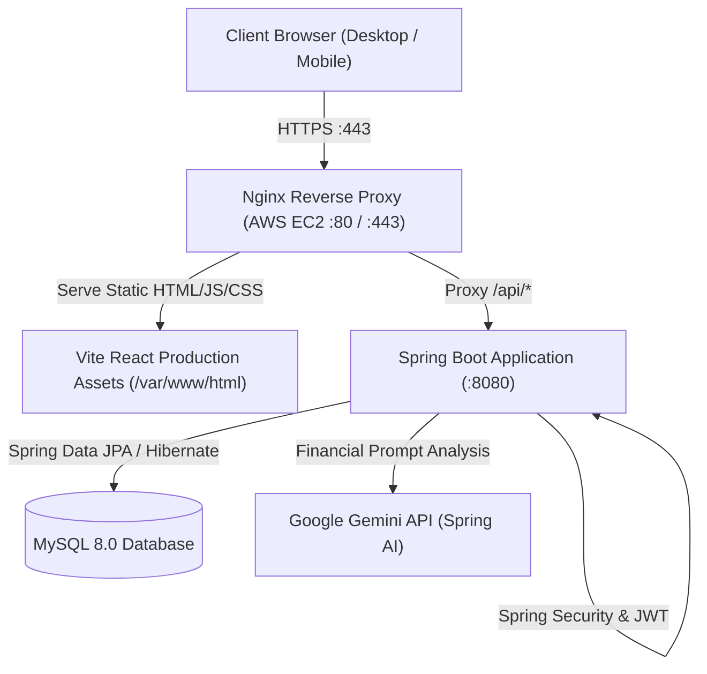
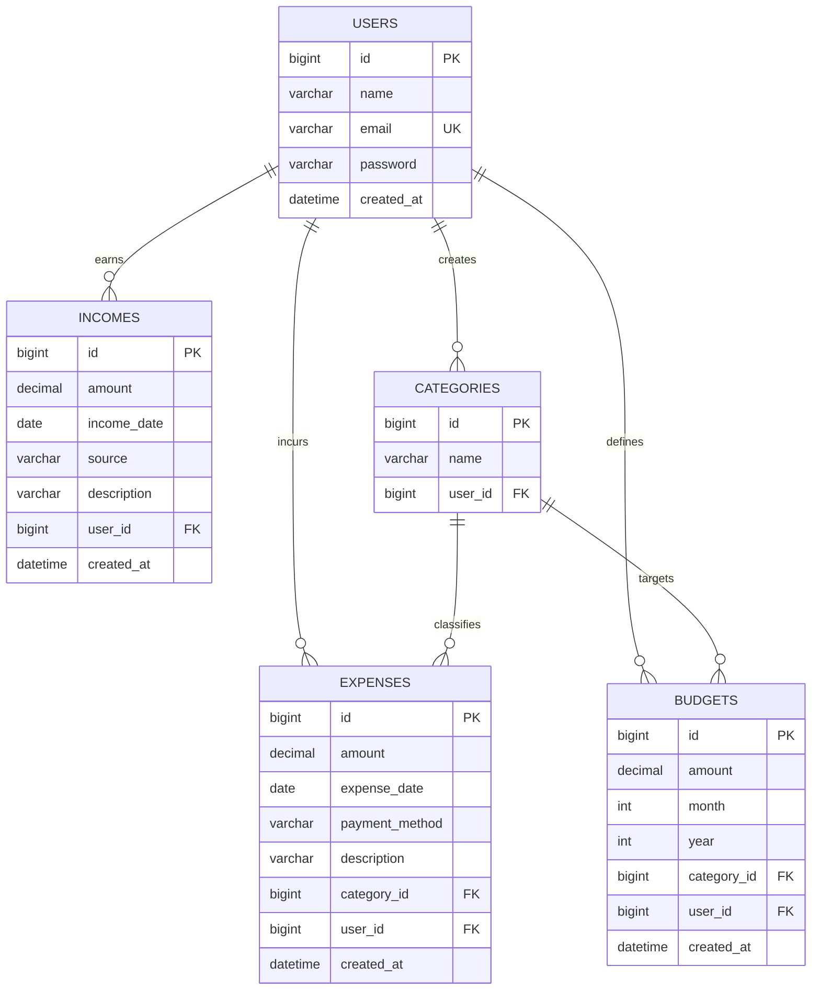

# 💸 ExpenseFlow — Smart Personal Finance Management Platform

<div align="center">

[](https://www.expenseflow.dev/)
[](https://react.dev/)
[](https://spring.io/projects/spring-boot)
[](https://www.mysql.com/)
[](https://aws.amazon.com/)
[](LICENSE)

**A modern, full-stack personal finance platform designed to track expenses, manage income, enforce monthly budgets, visualize financial trends, and provide AI-driven financial insights.**

[Explore Live Application](https://www.expenseflow.dev/) • [Report Bug](https://github.com/akkiiop/expenseflow/issues) • [Request Feature](https://github.com/akkiiop/expenseflow/issues)

</div>

---

## 📖 Table of Contents

- [Overview](#-overview)
- [Key Features](#-key-features)
- [System Architecture](#-system-architecture)
- [Tech Stack](#-tech-stack)
- [Database Schema](#-database-schema)
- [REST API Endpoints](#-rest-api-endpoints)
- [Getting Started](#-getting-started)
  - [Prerequisites](#prerequisites)
  - [Backend Setup (Spring Boot)](#backend-setup-spring-boot)
  - [Frontend Setup (React + Vite)](#frontend-setup-react--vite)
- [Environment Configuration](#-environment-configuration)
- [Production Deployment (AWS EC2 + Nginx)](#-production-deployment-aws-ec2--nginx)
- [Contributing](#-contributing)
- [License](#-license)

---

## 🌟 Overview

**ExpenseFlow** solves the chaos of personal money management. Built with a high-performance **React 19** frontend and a robust **Spring Boot** backend, it gives users complete control and visibility over their personal finances.

With seamless JWT authentication, dynamic category color systems, interactive budgeting thresholds, detailed analytics reports, and automated **Google Gemini AI insights**, ExpenseFlow transforms raw numbers into actionable financial intelligence.

---

## ✨ Key Features

- 🔐 **Stateless JWT Authentication**: Secure user registration, login, password hashing, and user-isolated data storage.
- 📊 **Real-time Financial Dashboard**: Instant metrics on total balance, monthly income, monthly expenses, spending breakdown, and quick transaction logs.
- 💳 **Expense Tracking**: Full CRUD management with category assignment, payment method tags (UPI, Cash, Card, Net Banking), dates, and notes.
- 💰 **Income Management**: Track income across multiple streams (Salary, Freelance, Investments) with date logging.
- 🎯 **Smart Budgeting & Alerts**: Set category-specific monthly budget caps with dynamic percentage progress bars and over-budget warnings.
- 🏷️ **Dynamic Categories**: Create personalized categories with automatic color-coding and icon badges.
- 📈 **Visual Reports & Analytics**: Interactive spending distributions, category percentages, and period summaries.
- 🤖 **AI Financial Insights**: Powered by **Spring AI & Google Gemini 1.5 Flash** to analyze spending patterns and provide personalized recommendations.
- 📱 **100% Responsive Design**: Clean dark fintech UI with glassmorphism, responsive navigation drawer, and mobile optimization.

---

## 🏗 System Architecture



---

## 🛠 Tech Stack

### **Frontend**
| Technology | Description |
|:---|:---|
| **React 19** | Modern reactive component architecture |
| **Vite 8** | Ultra-fast development server and optimized production bundler |
| **React Router v7** | Client-side routing with protected route guards |
| **Axios** | HTTP client with automatic JWT bearer token interceptors |
| **Lucide React** | Clean, modern featherweight vector iconography |
| **Vanilla CSS3** | Custom design system, CSS variables, glassmorphism, responsive tokens |

### **Backend**
| Technology | Description |
|:---|:---|
| **Java 21 (LTS)** | Modern Java features, records, and virtual thread readiness |
| **Spring Boot** | Enterprise backend application framework |
| **Spring Security** | Stateless JWT authentication and role/user isolation |
| **Spring Data JPA & Hibernate** | Object-relational database mapping and repository queries |
| **Spring AI** | Integration with LLMs via OpenAI-compatible endpoints |
| **Google Gemini 1.5 Flash** | Intelligent spending analysis and actionable financial advice |

### **Database & Infrastructure**
| Technology | Description |
|:---|:---|
| **MySQL 8.0** | Relational data persistence with foreign-key referential integrity |
| **AWS EC2 (Ubuntu 24.04)** | Cloud compute hosting the application server |
| **Nginx 1.24** | High-performance reverse proxy and static asset web server |
| **SSL / TLS** | Encrypted HTTPS communication |

---

## 🗄 Database Schema



---

## 🔌 REST API Endpoints

All protected endpoints require the header: `Authorization: Bearer <JWT_TOKEN>`.

### 🔐 Authentication
- `POST /api/auth/register` — Register a new account
- `POST /api/auth/login` — Authenticate and receive a JWT token

### 💳 Expenses
- `GET /api/expenses` — List user's expenses (supports pagination, date range, search)
- `POST /api/expenses` — Create a new expense entry
- `GET /api/expenses/{id}` — Retrieve expense details
- `PUT /api/expenses/{id}` — Update an expense
- `DELETE /api/expenses/{id}` — Delete an expense

### 💰 Income
- `GET /api/incomes` — List user's income records
- `POST /api/incomes` — Add new income record
- `PUT /api/incomes/{id}` — Update income record
- `DELETE /api/incomes/{id}` — Delete income record

### 🎯 Budgets
- `GET /api/budgets` — List monthly category budgets with spending progress
- `POST /api/budgets` — Set or update category budget limit
- `DELETE /api/budgets/{id}` — Remove a budget

### 🏷️ Categories
- `GET /api/categories` — Get list of user's custom categories
- `POST /api/categories` — Add a new custom category
- `DELETE /api/categories/{id}` — Delete a category

### 📊 Dashboard & Reports
- `GET /api/dashboard/summary` — Key KPIs (Total balance, monthly income, monthly expenses)
- `GET /api/reports/summary` — Aggregate reporting data across date periods and categories

### 🤖 AI Financial Insights
- `GET /api/ai/insights` — Generate personalized financial recommendations from user spending data

---

## 🚀 Getting Started

### Prerequisites
- **Java 21 JDK** or newer
- **Maven 3.9+**
- **Node.js 18+** & **npm**
- **MySQL 8.0+**

---

### Backend Setup (Spring Boot)

1. **Clone the repository**:
   ```bash
   git clone https://github.com/akkiiop/expenseflow.git
   cd expenseflow/expenseflow
   ```

2. **Configure Database**:
   Create a MySQL database named `expenseflow`:
   ```sql
   CREATE DATABASE expenseflow CHARACTER SET utf8mb4 COLLATE utf8mb4_unicode_ci;
   ```

3. **Set Environment Variables / Properties**:
   Configure your `src/main/resources/application.properties` or environment variables:
   ```properties
   DB_URL=jdbc:mysql://localhost:3306/expenseflow
   DB_USERNAME=root
   DB_PASSWORD=your_mysql_password
   GEMINI_API_KEY=your_google_gemini_api_key
   ```

4. **Run Backend**:
   ```bash
   mvn spring-boot:run
   ```
   The backend API will start at `http://localhost:8080`.

---

### Frontend Setup (React + Vite)

1. **Navigate to the frontend directory**:
   ```bash
   cd ../frontend
   ```

2. **Install dependencies**:
   ```bash
   npm install
   ```

3. **Start Development Server**:
   ```bash
   npm run dev
   ```
   Open `http://localhost:5173` in your browser.

---

## ⚙️ Environment Configuration

| Variable | Description | Default |
|:---|:---|:---|
| `DB_URL` | MySQL JDBC URL | `jdbc:mysql://localhost:3306/expenseflow` |
| `DB_USERNAME` | MySQL user | `root` |
| `DB_PASSWORD` | MySQL password | *empty* |
| `GEMINI_API_KEY` | Google Gemini API Key for AI Insights | *optional* |
| `VITE_API_URL` | Frontend API backend proxy target | `/api` (proxied by Vite/Nginx) |

---

## 🌐 Production Deployment (AWS EC2 + Nginx)

ExpenseFlow is deployed to an **AWS EC2 Ubuntu 24.04** instance with **Nginx** acting as the reverse proxy and SSL terminator.

```
                    Internet (HTTPS)
                           │
                           ▼
                  AWS EC2: Nginx (443)
                  ┌────────┴────────┐
                  ▼                 ▼
             /var/www/html        /api/*
          (Static React Build)  (Spring Boot :8080)
```

### Build & Deploy Commands

1. **Build Frontend**:
   ```bash
   cd frontend
   npm run build
   ```

2. **Deploy to EC2**:
   ```bash
   # SSH into AWS EC2
   ssh -i "expenseflow-key.pem" ubuntu@<EC2_PUBLIC_IP>

   # Pull latest code and copy static files to Nginx web root
   cd ~/frontend
   git pull origin frontend
   sudo rm -rf /var/www/html/*
   sudo cp -r ~/frontend/dist/* /var/www/html/
   sudo systemctl restart nginx
   ```

---

## 🤝 Contributing

Contributions are welcome! If you'd like to improve ExpenseFlow:

1. Fork the Project
2. Create your Feature Branch (`git checkout -b feature/AmazingFeature`)
3. Commit your Changes (`git commit -m 'feat: add some amazing feature'`)
4. Push to the Branch (`git push origin feature/AmazingFeature`)
5. Open a Pull Request

---

## 📄 License

Distributed under the **MIT License**. See `LICENSE` for more information.

---

<div align="center">
  <sub>Built with ❤️ by <a href="https://github.com/akkiiop">Akshay Kawade</a></sub>
</div>
