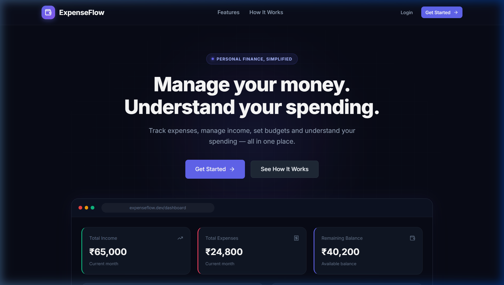
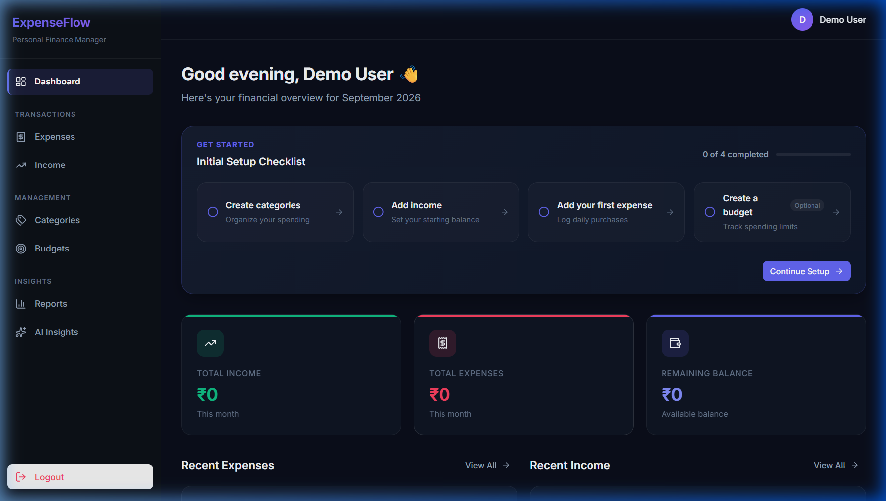
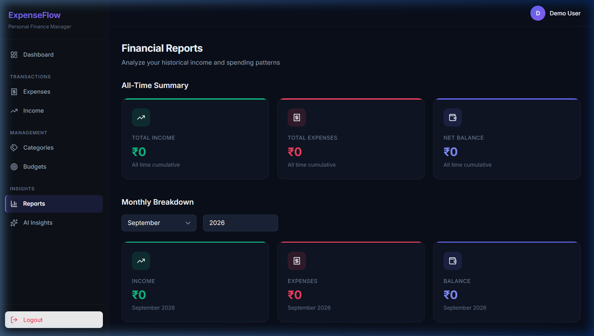
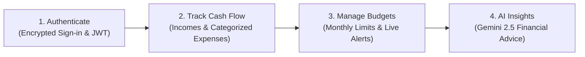
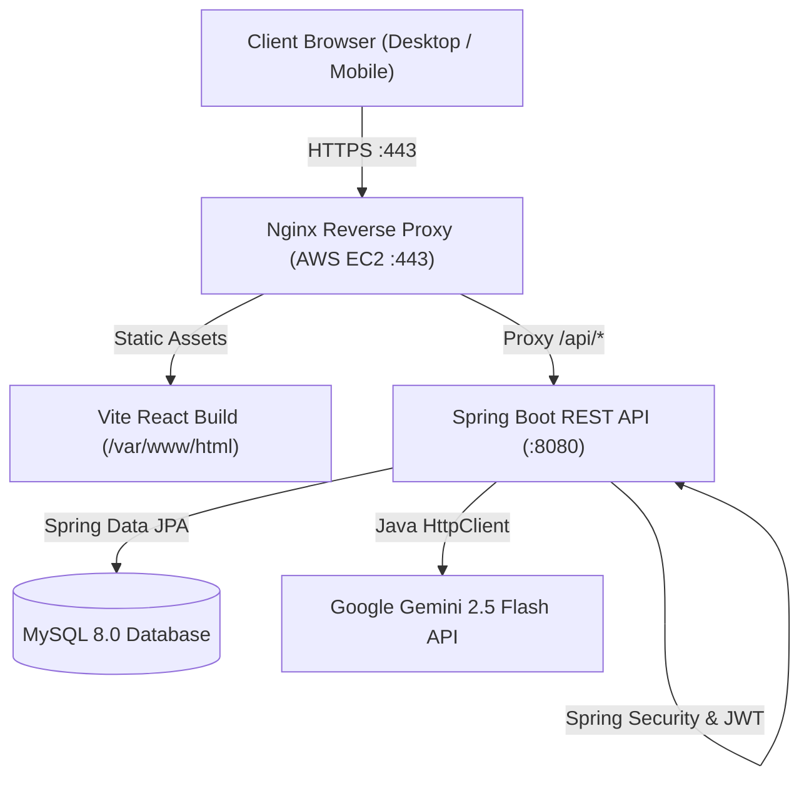
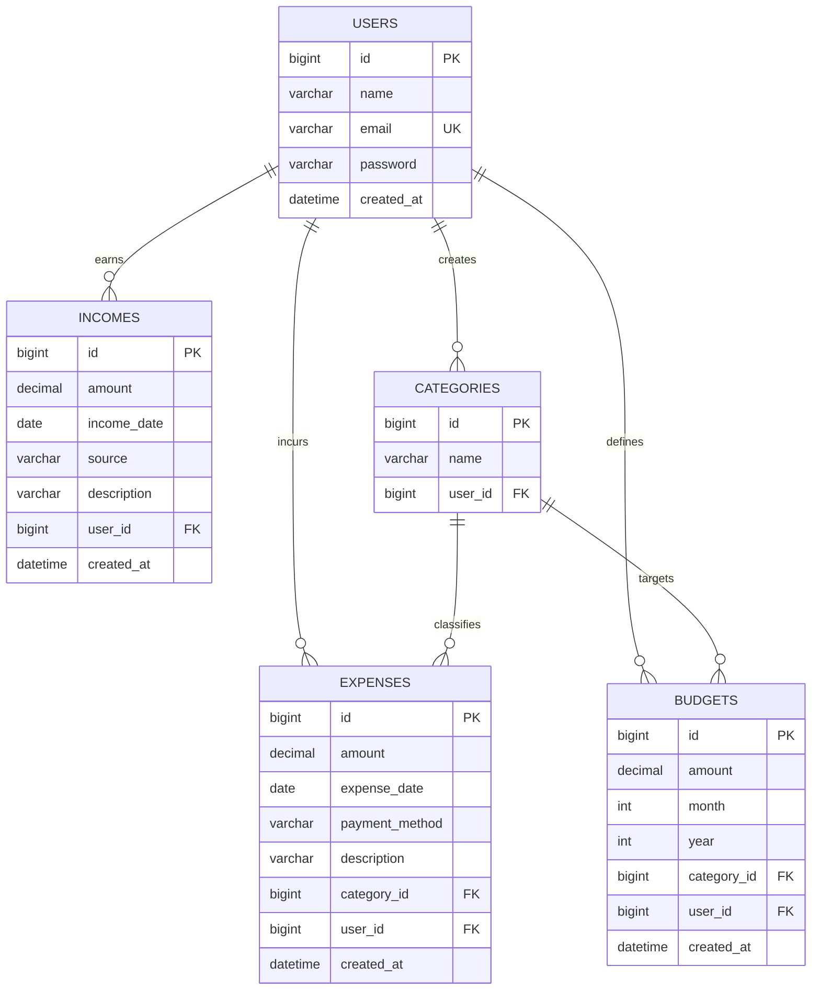

<div align="center">

# 💸 ExpenseFlow
### Full-Stack Personal Finance & AI Insights Platform

**A modern, production-deployed SaaS web application designed for comprehensive expense tracking, dynamic category budgeting, and automated spending advice powered by Google Gemini.**

<br/>

[🚀 **Explore Live Application**](https://www.expenseflow.dev/) &nbsp;&nbsp;•&nbsp;&nbsp; [📦 **Backend (Spring Boot)**](backend/) &nbsp;&nbsp;•&nbsp;&nbsp; [🎨 **Frontend (React 19)**](frontend/) &nbsp;&nbsp;•&nbsp;&nbsp; [🔌 **API Reference**](#-rest-api-reference) &nbsp;&nbsp;•&nbsp;&nbsp; [🏗️ **Architecture**](#-system-architecture)

<br/>

</div>

---

### ⚡ System Overview at a Glance

| 🌐 Production Deployment | 💻 Frontend Architecture | ⚙️ Backend Architecture | 🗄️ Database & Storage | 🤖 Artificial Intelligence | ☁️ Cloud & Web Server |
|:---|:---|:---|:---|:---|:---|
| [**www.expenseflow.dev**](https://www.expenseflow.dev/) | **React 19** + **Vite 8** | **Spring Boot 4.1** (Java 21) | **MySQL 8.0** | **Google Gemini 2.5 Flash** | **AWS EC2** (Ubuntu 24.04) |
| Active HTTPS / SSL Certificate | React Router v7 & Custom CSS | Spring Security 6 & JWT | Spring Data JPA / Hibernate | Native Java 21 `HttpClient` | Nginx 1.24 Reverse Proxy |

---

## 📸 Application Showcase

| 🌟 Public Landing Page | 📊 Authenticated Financial Dashboard |
|:---:|:---:|
| [](https://www.expenseflow.dev/) | [](https://www.expenseflow.dev/) |

<div align="center">

| 📈 Visual Reports & Analytics Trends |
|:---:|
| [](https://www.expenseflow.dev/) |

</div>

---

## 💡 How It Works



1. **Authenticate**: Register or log in to establish an encrypted user session secured by stateless JWT authentication.
2. **Track Cash Flows**: Record multiple income sources and log daily expenses categorized with payment methods (UPI, Cash, Card) and transaction dates.
3. **Set Category Budgets**: Define monthly budget limits per category and monitor real-time spending progress bars with over-budget alerts.
4. **Analyze & Optimize**: Review period-based spending summaries, category distribution analytics, and receive actionable financial guidance from Gemini 2.5 Flash.

---

## 🧩 What I Built

ExpenseFlow demonstrates end-to-end full-stack software engineering capabilities:

- **Layered REST Architecture**: Clean Controller-Service-Repository-DTO separation in Spring Boot.
- **Stateless Authentication**: JWT issuance, validation, and BCrypt password encryption with Spring Security.
- **Strict Data Isolation**: User-scoped database transactions preventing multi-tenant data leakage.
- **Relational Schema Modeling**: Normalized MySQL database design with foreign keys and JPA entity associations.
- **Responsive UI Engineering**: React 19 Single Page Application with custom dark fintech styling and mobile drawer navigation.
- **Direct LLM Integration**: Pure Java 21 `HttpClient` integration streaming prompts to Google's Gemini 2.5 Flash API.
- **Production DevOps**: Deployed on AWS EC2 with Nginx reverse proxy configuration, SSL certificates, and custom domain routing.

---

## ✨ Features

- 🔐 **JWT Authentication**: Secure user registration, login, password hashing, and token-based route guards.
- 📊 **Financial Dashboard**: Overview of monthly income, monthly expenses, net balance, and spending breakdown.
- 💳 **Expense Tracking**: Log, edit, and delete expenses with categories, payment methods (UPI, Cash, Card), and notes.
- 💰 **Income Management**: Record earnings across multiple income streams with transaction dates.
- 🎯 **Budget Management**: Set monthly spending limits per category and monitor consumption progress.
- 🏷️ **Custom Categories**: Create user-defined spending categories with automated color-coded badges.
- 📈 **Financial Reports**: Visual summaries of spending patterns and category distributions.
- 🤖 **AI Spending Insights**: Actionable spending observations generated via Google Gemini 2.5 Flash.
- 📱 **Responsive UI**: Dark fintech theme with mobile navigation drawer and tablet-friendly layouts.

---

## 🏗 System Architecture



---

## 🛠 Tech Stack

| Layer | Technology | Exact Version | Description |
|:---|:---|:---|:---|
| **Frontend Framework** | React | `^19.3.0` | Modern component-based user interface |
| **Build Tool** | Vite | `^8.3.0` | Production bundler and local dev server |
| **Client Routing** | React Router DOM | `^7.18.4` | Client-side routing with route guards |
| **HTTP Client (Web)** | Axios | `^1.20.0` | API requests with JWT interceptors |
| **Iconography** | Lucide React | `^1.47.0` | Lightweight vector icons |
| **Styling** | Vanilla CSS3 | Standard | Custom fintech dark theme, CSS tokens, responsive layout |
| **Backend Framework** | Spring Boot | `4.1.1` | Enterprise REST API application framework |
| **Language & Runtime** | Java (OpenJDK) | `21 (LTS)` | Modern language features, records, and pattern matching |
| **Security** | Spring Security | `6.x` | Stateless authentication and endpoint authorization |
| **JWT Library** | JJWT | `0.11.5` | Secure token generation and signature verification |
| **ORM / Database Access** | Spring Data JPA | Hibernate 6 | Relational mapping and repository queries |
| **Relational Database** | MySQL | `8.0` | Production persistence with foreign key constraints |
| **AI Integration** | Google Gemini | `gemini-2.5-flash` | Direct HTTP integration via native Java 21 `HttpClient` |
| **Cloud Hosting** | AWS EC2 | Ubuntu 24.04 | Cloud virtual server compute instance |
| **Reverse Proxy / SSL** | Nginx | `1.24` | Reverse proxy for `/api/*` and static asset server |

---

## 🗄 Database Schema



---

## 🔌 REST API Reference

All protected endpoints require the HTTP header: `Authorization: Bearer <JWT_TOKEN>`.

### 🔐 User & Authentication (`/api/users`)
- `POST /api/users` — Register a new account
- `POST /api/users/login` — Authenticate and receive JWT token
- `GET /api/users/me` — Retrieve current authenticated user profile
- `GET /api/users/{id}` — Retrieve user by ID
- `PUT /api/users/{id}` — Update user profile
- `DELETE /api/users/{id}` — Delete user account

### 💳 Expenses (`/api/expenses`)
- `POST /api/expenses` — Create a new expense
- `GET /api/expenses/my-expenses?page=0&size=10&categoryId=` — List paginated expenses with optional category filter
- `GET /api/expenses/{id}` — Retrieve expense details
- `PUT /api/expenses/{id}` — Update an expense
- `DELETE /api/expenses/{id}` — Delete an expense

### 💰 Incomes (`/api/incomes`)
- `POST /api/incomes` — Create a new income record
- `GET /api/incomes/my-incomes?page=0&size=10` — List paginated income records
- `GET /api/incomes/{id}` — Retrieve income details
- `PUT /api/incomes/{id}` — Update an income record
- `DELETE /api/incomes/{id}` — Delete an income record

### 🎯 Budgets (`/api/budgets`)
- `POST /api/budgets` — Create/set a category budget limit
- `GET /api/budgets/my-budgets` — List all budgets for authenticated user
- `GET /api/budgets/{id}` — Retrieve budget details
- `PUT /api/budgets/{id}` — Update budget limit
- `DELETE /api/budgets/{id}` — Delete a budget

### 🏷️ Categories (`/api/categories`)
- `POST /api/categories` — Create custom category
- `GET /api/categories/my-categories` — List user's custom categories
- `GET /api/categories/{id}` — Retrieve category details
- `PUT /api/categories/{id}` — Update category name
- `DELETE /api/categories/{id}` — Delete a category

### 📊 Dashboard & Reports
- `GET /api/dashboard/summary?month={m}&year={y}` — Get monthly KPI summary (income, expenses, balance, category breakdown)
- `GET /api/reports/summary` — Get aggregated financial report data

### 🤖 AI Insights (`/api/ai`)
- `GET /api/ai/insights` — Generate personalized spending recommendations using Google Gemini 2.5 Flash

---

## 📁 Repository Structure

```
expenseflow/
│
├── backend/                  # Spring Boot Java 21 REST API
│   ├── src/
│   │   ├── main/java/com/expenseflow/
│   │   │   ├── ai/           # Gemini API integration via Java HttpClient
│   │   │   ├── budget/       # Budget management service & controller
│   │   │   ├── category/     # Custom category management
│   │   │   ├── common/       # Security (JWT), exceptions, configs
│   │   │   ├── dashboard/    # KPI metrics & aggregates
│   │   │   ├── expense/      # Expense CRUD & pagination
│   │   │   ├── income/       # Income streams tracker
│   │   │   ├── report/       # Financial reporting & analytics
│   │   │   └── user/         # Auth & User management
│   │   └── resources/        # application.properties
│   ├── pom.xml               # Maven configuration (Spring Boot 4.1.1, Java 21)
│   └── mvnw                  # Maven wrapper
│
├── frontend/                 # React 19 + Vite 8 SPA
│   ├── public/               # Favicon & vector icons
│   ├── src/
│   │   ├── components/       # Reusable components (Navbar, Sidebar, Modal, Toast)
│   │   ├── pages/            # Landing, Dashboard, Expenses, Income, Budgets, Reports
│   │   ├── services/         # Axios API service modules
│   │   ├── utils/            # Category color mapping & helpers
│   │   ├── App.jsx           # Routing & route guards
│   │   └── index.css         # Design system & tokens
│   ├── index.html            # Entry HTML
│   ├── package.json          # Node dependencies (React 19, Vite 8)
│   └── vite.config.js        # Vite configuration
│
├── docs/                     # Documentation & screenshots
│   └── images/               # Application preview screenshots
│
├── .gitignore                # Unified root git ignore rules
└── README.md                 # Project documentation
```

---

## 🚀 Getting Started

### Prerequisites
- **Java 21 JDK** or newer
- **Maven 3.9+** (or use included `./mvnw`)
- **Node.js 18+** & **npm**
- **MySQL 8.0+**

---

### Backend Setup (Spring Boot)

1. **Navigate to backend directory**:
   ```bash
   cd backend
   ```

2. **Configure Database**:
   Create a MySQL database named `expenseflow`:
   ```sql
   CREATE DATABASE expenseflow CHARACTER SET utf8mb4 COLLATE utf8mb4_unicode_ci;
   ```

3. **Configure Properties / Environment**:
   Update `src/main/resources/application.properties` or set environment variables:
   ```properties
   DB_URL=jdbc:mysql://localhost:3306/expenseflow
   DB_USERNAME=root
   DB_PASSWORD=your_mysql_password
   GEMINI_API_KEY=your_google_gemini_api_key
   ```

4. **Run Backend**:
   ```bash
   mvn spring-boot:run
   ```
   The backend API will start at `http://localhost:8080`.

---

### Frontend Setup (React + Vite)

1. **Navigate to frontend directory**:
   ```bash
   cd ../frontend
   ```

2. **Install dependencies**:
   ```bash
   npm install
   ```

3. **Start Development Server**:
   ```bash
   npm run dev
   ```
   Open `http://localhost:5173` in your browser.

---

## ⚙️ Environment Variables

| Variable | Description | Default |
|:---|:---|:---|
| `DB_URL` | MySQL JDBC Connection URL | `jdbc:mysql://localhost:3306/expenseflow` |
| `DB_USERNAME` | MySQL database username | `root` |
| `DB_PASSWORD` | MySQL database password | *empty* |
| `GEMINI_API_KEY` | Google Gemini API Key for AI Insights | *optional* |

---

## 🌐 Production Deployment (AWS EC2 + Nginx)

ExpenseFlow is deployed to an **AWS EC2 Ubuntu 24.04** instance with **Nginx** acting as the reverse proxy and SSL terminator.

```
                   Internet (HTTPS)
                          │
                          ▼
                 AWS EC2: Nginx (443)
                 ┌────────┴────────┐
                 ▼                 ▼
            /var/www/html        /api/*
         (Static React Build)  (Spring Boot :8080)
```

### Full Monorepo Deployment Steps

1. **Connect to AWS EC2**:
   ```bash
   ssh -i "expenseflow-key.pem" ubuntu@<EC2_PUBLIC_IP>
   ```

2. **Pull Latest Monorepo Changes**:
   ```bash
   cd ~/expenseflow
   git pull origin main
   ```

3. **Build & Deploy Frontend (Static Web Root)**:
   ```bash
   cd ~/expenseflow/frontend
   npm install
   npm run build
   sudo rm -rf /var/www/html/*
   sudo cp -r dist/* /var/www/html/
   sudo systemctl restart nginx
   ```

4. **Build & Restart Backend Service**:
   ```bash
   cd ~/expenseflow/backend
   ./mvnw clean package -DskipTests
   sudo systemctl restart expenseflow
   ```

---

## 📄 License

Distributed under the **MIT License**.

---

<div align="center">
  <sub>Built by <a href="https://github.com/akkiiop">Akshay Kawade</a> • <a href="https://www.expenseflow.dev/">expenseflow.dev</a></sub>
</div>
